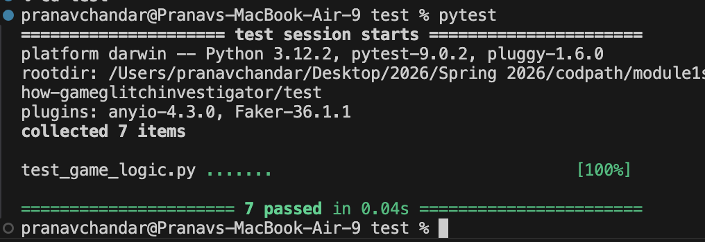
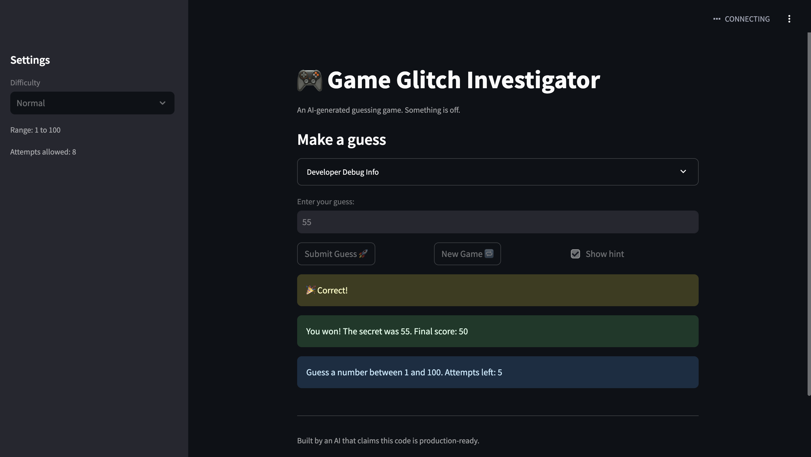

# 🎮 Game Glitch Investigator: The Impossible Guesser

## 🚨 The Situation

You asked an AI to build a simple "Number Guessing Game" using Streamlit.
It wrote the code, ran away, and now the game is unplayable. 

- You can't win.
- The hints lie to you.
- The secret number seems to have commitment issues.

## 🛠️ Setup

1. Install dependencies: `pip install -r requirements.txt`
2. Run the broken app: `python -m streamlit run app.py`

## 🕵️‍♂️ Your Mission

1. **Play the game.** Open the "Developer Debug Info" tab in the app to see the secret number. Try to win.
2. **Find the State Bug.** Why does the secret number change every time you click "Submit"? Ask ChatGPT: *"How do I keep a variable from resetting in Streamlit when I click a button?"*
3. **Fix the Logic.** The hints ("Higher/Lower") are wrong. Fix them.
4. **Refactor & Test.** - Move the logic into `logic_utils.py`.
   

## 📝 Document Your Experience

**What the game does:**
It's a number guessing game built with Streamlit where you try to guess a secret number within a limited number of attempts. You pick a difficulty, get a range to guess from, and the game gives you hints after each guess telling you to go higher or lower until you either win or run out of tries.

**Bugs I found:**

1. The attempts counter started at 1 instead of 0 so it already showed one attempt used before you even guessed anything. Also because Streamlit reruns the script top to bottom on every interaction the display was rendering before the increment happened so the counter looked stuck after the first guess.

2. You could type in negative numbers or anything way outside the valid range and the game would just accept it. There was no check to make sure the input was actually within the allowed range for the difficulty.

3. The New Game button did nothing after the game ended. It was resetting attempts and picking a new secret but it never reset the status back to "playing" so the game immediately hit st.stop() again on the next rerun and stayed locked.

4. When you switched difficulty the range shown on screen would update in the sidebar but the new game button was still generating secrets using hardcoded 1 to 100 instead of the actual range for that difficulty.

5. The hint messages were completely backwards. If your guess was too high it told you to go higher and if it was too low it told you to go lower which made the game basically unwinnable by following the hints.

**Fixes I applied:**

- Changed attempts initialization from 1 to 0 and moved the attempts display to after the submit handler so it always shows the updated count
- Added a bounds check after parsing the guess to reject anything outside the valid range for the current difficulty
- Added `st.session_state.status = "playing"` to the new game handler so the game actually resets properly after a win or loss
- Replaced the hardcoded `random.randint(1, 100)` in the new game handler with `random.randint(low, high)` so difficulty is respected
- Swapped the hint messages in `check_guess` so Too High says Go LOWER and Too Low says Go HIGHER. 

## 📸 Demo

- 

## 🚀 Stretch Features

- [ ] [If you choose to complete Challenge 4, insert a screenshot of your Enhanced Game UI here]
